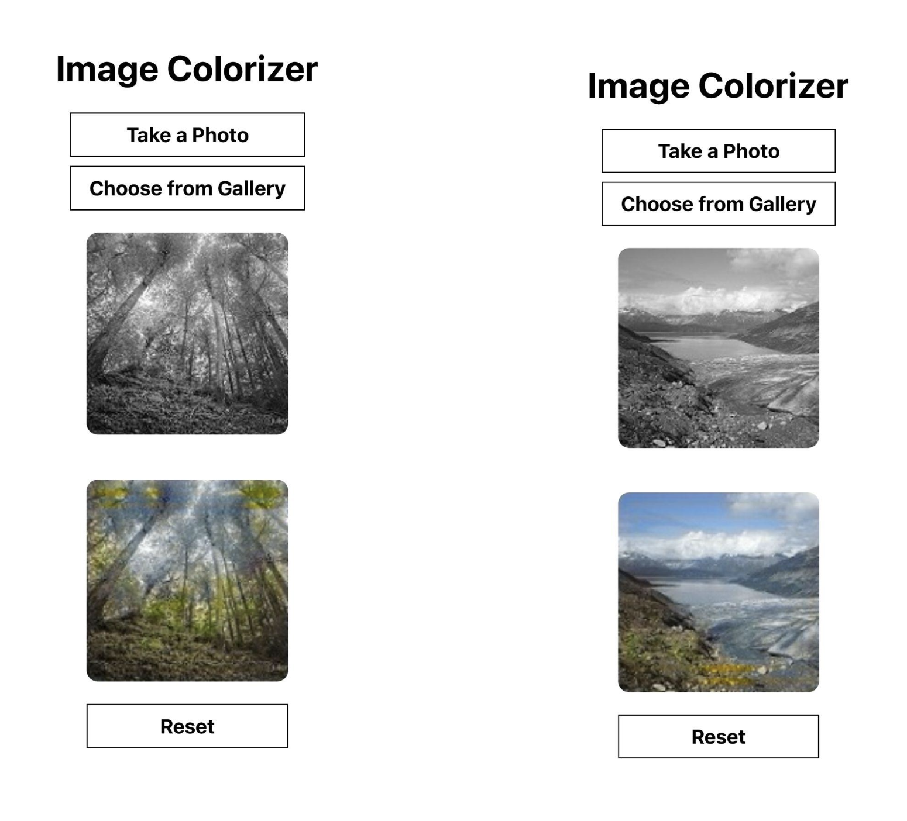

# Image Colorizer

A mobile application that colorizes black and white images using AI, consisting of a Flask backend server and a React Native mobile app.

## App Preview

Below is an illustration of the **Image Colorizer** mobile application and its colorization results.



## Project Structure

- `BE-Image-colorizer/` - Backend Flask server with AI model
- `image-colorizer/` - React Native mobile application

## Backend

The backend is built with Flask and uses a deep learning model to colorize black and white images. Images are uploaded to the server, processed through the AI model, and the colorized result is returned.

## Mobile App

The mobile app is built with React Native and Expo. It allows users to:

- Pick images from their device
- Send images to the backend for colorization
- View the colorized results

## Getting Started

### Backend Setup

```bash
cd BE-Image-colorizer
pip install -r requirements.txt
python app.py
```

### Mobile App Setup

```bash
cd image-colorizer
npm install
npx expo start
```
